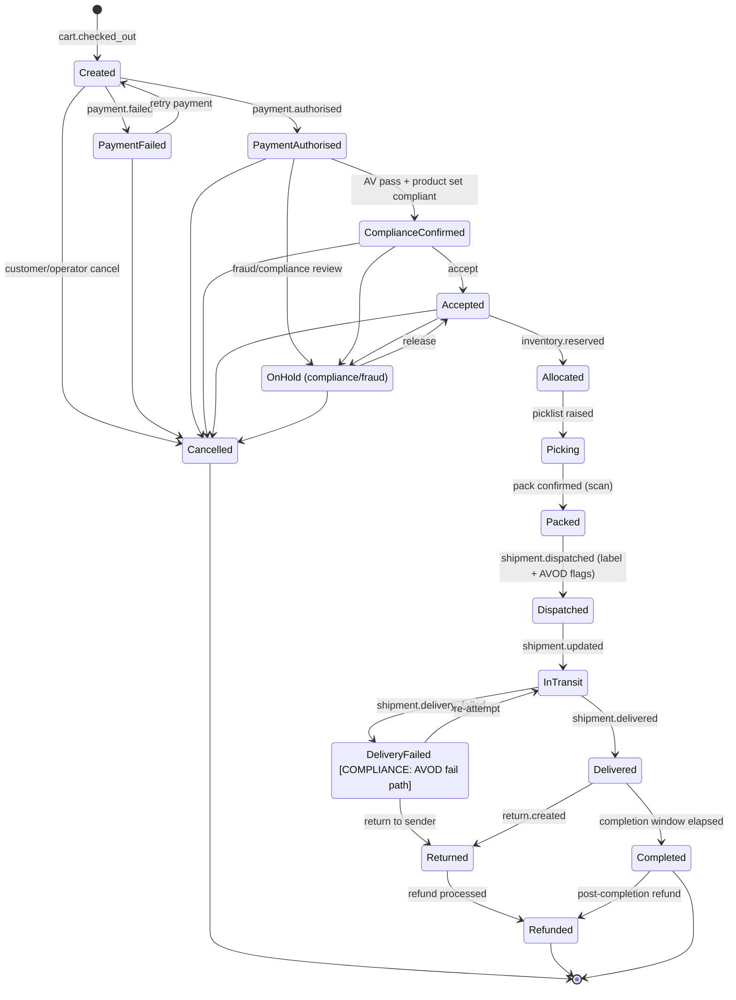
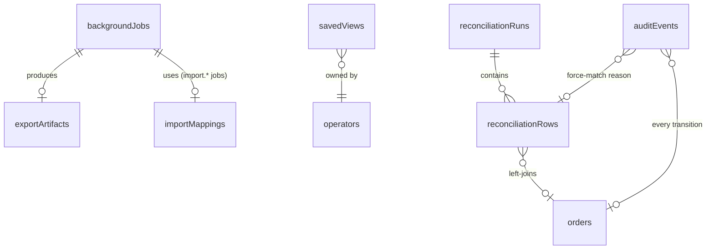
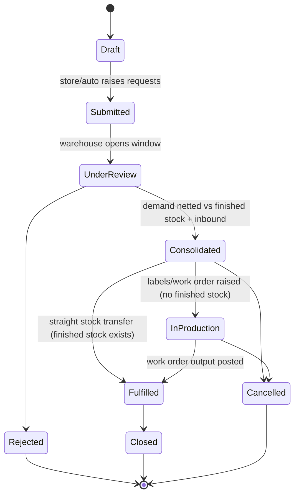
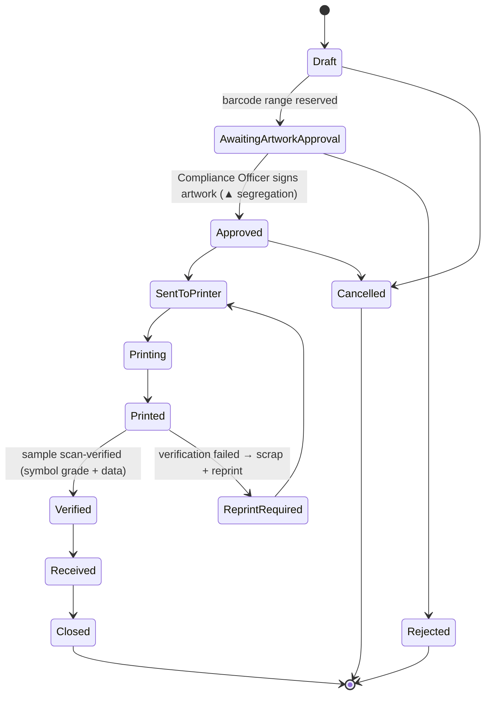
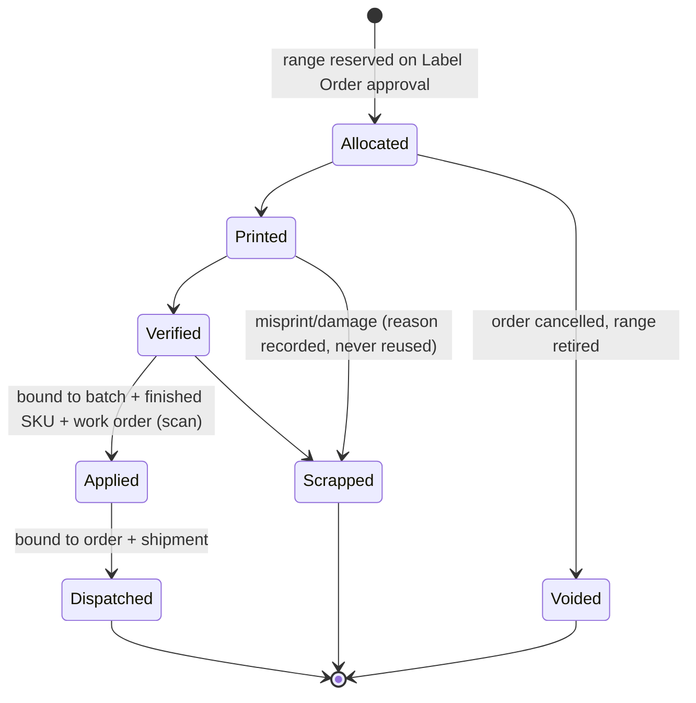

# Phoenix Vapers Commerce Platform — Developer Edition Specification (Volume 2.0)

**The buildable companion to the Commerce Platform Specification (Edition 1.0).**
Next.js 16 · NestJS · MongoDB · Turborepo/pnpm · Tailwind v4 design-system tokens

> **Status:** Governing for the Admin Console, the Intelligence Dashboards, the Bulk-Operations Hub, Order Management, and the operational data model. Where this volume specifies a screen, an interaction, a payload, or a schema, **it supersedes** the prose in Edition 1.0 Parts Four, Five and Six for the same subject. Everything Edition 1.0 marks `[COMPLIANCE]` remains mandatory and fails closed; this volume only makes those controls *concrete in the UI*.

---

## 0. Document Control

### 0.1 Why this volume exists

Edition 1.0 is authoritative on **strategy** (Part 1), **compliance** (Part 1 §4), and **architecture** (Part 3). It is deliberately exhaustive there and must not be diluted. But Parts Four (Experience), Five (Admin Console §25) and Six (Operations §26–§31) describe *intent* — "the admin can manage inventory", "show live KPIs", "bulk actions on every list" — without the pixel-, payload- and state-level detail a UI designer or full-stack engineer needs to build without asking questions.

This volume closes that gap. It is written so that:

- a **UI/UX designer** can open any section and sketch a high-fidelity wireframe from the described layout, regions, columns, states and interactions;
- a **full-stack engineer** can open the same section and build it — every table column, every modal, every bulk action, every WebSocket frame, every Mongo collection, every RBAC gate is specified;
- a **QA engineer** can derive Given/When/Then cases directly, because every `[COMPLIANCE]` rule is mapped to a specific, testable UI blocker.

### 0.2 What this volume covers

| # | Deliverable | Replaces / extends in Edition 1.0 |
|---|---|---|
| **D1** | Console foundations & shared developer primitives (RBAC matrix, Query Builder, Saved Views, Audit Visual Diff, Bulk-Action framework, Background-Job framework, the canonical List-Page anatomy) | New — the "missing nuts and bolts" behind §25.2 |
| **D2** | The Admin Intelligence Dashboard — KPI cards, WebSocket contract, Sales Heatmap, UK Geographic Heatmap, Channel-Mix donuts with drill-down, Anomaly Feed | **Rewrites §28** (and §14.1) |
| **D3** | Sales & Bulk Operations Hub — CSV/XLSX import wizard, Download Centre / export queue, Sales Reconciliation Grid | New section (extends §14.3, §13.1, §28.5) |
| **D4** | Order Management & State Machines — Mermaid state diagrams, Bulk-Action Toolbar, Order Detail Slide-Over | **Rewrites §7 & §25** for the operator surface |
| **D5** | Operational Data-Model Extensions — `backgroundJobs`, `savedViews`, `importMappings`, `reconciliationRuns`, `exportArtifacts` | **Extends §18** |
| **D6** | Compliance-to-UI blocker map — every `[COMPLIANCE]` requirement bound to a specific disabled/blocked control | New — the QA/Compliance bridge |

### 0.3 How to read a screen specification

Every screen in this volume is specified in the same order, so designers and engineers always know where to look:

1. **Purpose & primary user** — which operator role (§3.2) lives here and what decision they make.
2. **Route & shell** — the `apps/admin`… wait: in this repository the admin console currently ships **inside `apps/web` under `/admin`** (see §D1.1). Routes are given as real Next.js App Router paths.
3. **Component hierarchy** — a real React tree, JSX (never TSX — front-ends are `.jsx`, per the standing project decision), naming the components an engineer will create.
4. **Layout & regions** — the visual grid, described so a designer can draw it.
5. **Data contract** — the TypeScript/Zod types and the API endpoints that feed it.
6. **States** — loading (skeleton), empty, error, and the `[COMPLIANCE]` blocked state.
7. **Interactions & actions** — every button, its RBAC gate, its confirmation, its audit event.

### 0.4 Non-negotiable inheritances from Edition 1.0

These are restated because every screen below assumes them:

- **Design system is the only styling source.** Colours, type and spacing come from `@phoenix/design-system` tokens (`packages/design-system/src/tokens.css`). No screen defines its own palette. Console chrome (sidebar, top bars) is **Ink Green / `forest-ink`** in both themes; green *text* on light surfaces uses **`pine` / `deep-pine`**, never `phoenix-green` (the Deep Pine rule). Corner radius is `0` — surfaces are crisp rectangles, not rounded cards.
- **Front-ends are JSX.** `apps/web` (which hosts `/admin`) is `.js`/`.jsx`. The NestJS API (`apps/api`) is TypeScript. TypeScript interfaces in this document define **API/data contracts**; the React components that consume them are authored in JSX with JSDoc types.
- **Security first.** Zod at every boundary; fail-closed auth; the API enforces every action even when the UI has already hidden the button; operator auth is the interim `X-Admin-Token` header (`ADMIN_API_TOKENS`) until OIDC lands.
- **The API is the authority.** The console **never renders an action the backend would refuse** (§25.1). RBAC in the UI is a courtesy and a clarity feature; it is *not* the enforcement boundary.

---

# PART D1 · CONSOLE FOUNDATIONS & DEVELOPER PRIMITIVES

Everything in D2–D4 is assembled from the primitives in this part. They are specified once here and referenced by name thereafter, exactly as Edition 1.0 §25.2 intended but never delivered.

## D1.1 The console shell (as-built)

The console is **not** yet a separate `apps/admin` deployable; in this repository it is the `/admin` route tree inside `apps/web`, rendered by `AdminShell` (`apps/web/components/admin/admin-shell.jsx`). This volume specifies against that reality and notes, per screen, what changes when the console is later extracted to `apps/admin` (a mechanical move — the components and contracts do not change).

```
apps/web/
  app/admin/
    layout.js                 → <AdminShell> (Ink Green sidebar, role-filtered nav)
    page.js                   → Home / role dashboard            (D2)
    orders/
      page.js                 → Orders list + Bulk-Action Toolbar (D4)
      [orderNumber]/page.js   → Order Detail Slide-Over host      (D4)
    customers/  fulfilment/  marketing/  products/  reports/  staff/
  components/admin/
    admin-shell.jsx           (exists)
    console-placeholder.jsx   (exists)
    product-import-form.jsx   (exists — the seed of D3's import wizard)
```

**Shell regions** (from `AdminShell`, extended by this volume):

| Region | Component | Behaviour |
|---|---|---|
| Left rail | `<AdminSidebar>` (in `AdminShell`) | `forest-ink` background, `chrome-fg` text; nav pre-filtered to the operator's permitted areas (§D1.3). Collapses to a horizontal scroller under `md`. |
| Command bar | `<CommandPalette>` (**new**, `⌘K` / `Ctrl+K`) | Jump to any order, customer, SKU, batch, serial, screen; run permitted actions by name. Specified in §D1.7. |
| Global search | `<GlobalSearch>` (**new**, in top bar) | One box resolving across orders/customers/SKUs/batches/shipments/tickets/barcodes. Scanning a serial jumps to its unit→batch→order. |
| Work region | `{children}` | `max-w-6xl` today; list pages opt out to full-bleed (§D1.6). |
| Notification bell | `<DownloadCenterBell>` (**new**) | Badge-counted; hosts the export Download Centre (§D3.2) and operator inbox (§D1.8). |

> **Extraction note:** when the console moves to `apps/admin`, `AdminShell` and every `components/admin/*` primitive move verbatim; only the import root (`@/`) and the deploy target change.

## D1.2 The seven operator roles (as-built)

These are the **real** roles in the codebase (`admin-shell.jsx` `ROLE_LABEL`, and the operator schema). Every permission, every button-gate, and every segregation-of-duties rule below uses exactly these identifiers.

```ts
// packages/types/src/rbac.ts  (contract; consumed by API + both front-ends)
export type OperatorRole =
  | 'merchandiser'
  | 'compliance_officer'
  | 'customer_support'
  | 'finance'
  | 'fulfilment'
  | 'marketing'
  | 'platform_admin';
```

## D1.3 RBAC — the Permission Matrix & the `can()` primitive `[COMPLIANCE]`

Edition 1.0 §3.2 mandates least-privilege and **segregation of duties** but never says how the UI expresses it. This is the mechanism.

### D1.3.1 Actions & resources

Permissions are `resource:action` tuples. Actions are the CRUD set plus the domain verbs the business actually performs:

```ts
// packages/types/src/rbac.ts
export type Action =
  | 'create' | 'read' | 'update' | 'delete'
  | 'approve'      // second-authority sign-off (compliance/finance gates)
  | 'export'       // pull data out (governed — §D3.2)
  | 'hold' | 'release'
  | 'refund'
  | 'impersonate'; // read-only, audited (§25.2)

export type Resource =
  | 'order' | 'customer' | 'product' | 'compliance_profile'
  | 'inventory' | 'label_order' | 'serial'
  | 'price' | 'promotion' | 'refund' | 'settlement'
  | 'campaign' | 'newsletter' | 'content'
  | 'operator' | 'role' | 'feature_flag' | 'config' | 'audit';

export type Permission = `${Resource}:${Action}`;
```

### D1.3.2 The matrix

The matrix is the single source of truth for what the UI *offers*. It is generated into a typed constant and shipped to both the API (enforcement) and the console (rendering). `▲` marks a **segregation-of-duties** permission: holding it does not let the *same* operator also perform the paired `create`/`update` on the same artefact (§D1.3.4).

```ts
// packages/types/src/permission-matrix.ts
export const PERMISSION_MATRIX: Record<OperatorRole, Permission[]> = {
  merchandiser: [
    'product:create', 'product:read', 'product:update',
    'compliance_profile:read',            // can SEE, cannot approve
    'price:read', 'price:update',
    'promotion:create', 'promotion:read', 'promotion:update',
    'content:create', 'content:read', 'content:update',
    'order:read', 'customer:read', 'inventory:read',
  ],
  compliance_officer: [
    'compliance_profile:read', 'compliance_profile:approve', // ▲ approve, never create the product
    'product:read',
    'label_order:read', 'label_order:approve',               // ▲ artwork approval (§26.4)
    'serial:read',
    'order:read', 'order:hold',                              // can HOLD for review, cannot dispatch
    'customer:read',
    'audit:read', 'audit:export',
    'config:read',                                           // duty params etc. — approve via ▲ below
  ],
  customer_support: [
    'customer:read', 'customer:update',
    'order:read', 'order:hold', 'order:release',
    'refund:create',                                         // within a role limit (§D1.3.3)
    'customer:impersonate',                                  // read-only, audited
  ],
  finance: [
    'order:read',
    'settlement:read', 'settlement:approve',                 // ▲ force-match reconciliation (§D3.3)
    'refund:read', 'refund:approve',                         // ▲ approve refunds above CS limit
    'price:read', 'config:read',
    'export': undefined as never,                            // (see note) finance export is per-resource
    'audit:read',
  ].filter(Boolean) as Permission[],
  fulfilment: [
    'order:read', 'order:release',
    'inventory:read', 'inventory:update',
    'label_order:read',
    'serial:read', 'serial:update',                          // print/verify/apply transitions (§26.5)
  ],
  marketing: [
    'campaign:create', 'campaign:read', 'campaign:update',
    'newsletter:create', 'newsletter:read',                  // send requires compliance approval ▲
    'content:read',
    'customer:read',                                          // segments only — sensitive fields masked
  ],
  platform_admin: [
    'operator:create', 'operator:read', 'operator:update', 'operator:delete',
    'role:read', 'role:update',
    'feature_flag:read', 'feature_flag:update',
    'config:read', 'config:update',
    'audit:read', 'audit:export',
    // Operational oversight — broad READ + the order hold/release controls
    // an admin already operates. NOT a compliance override (see exclusions).
    'order:read', 'order:hold', 'order:release',
    'customer:read', 'product:read', 'inventory:read',
    // NB: platform_admin deliberately does NOT hold compliance_profile:approve,
    // settlement:approve or refund:approve — segregation of duties is not
    // waived for admins.
  ],
};
```

> **Finance `export` note:** the `.filter(Boolean)` line above is illustrative of a real trap — `export` is never a blanket grant; it is always `resource:export` (e.g. `settlement:export`, `order:export`). Ship the matrix with explicit tuples, not a wildcard. The console's export buttons (§D3.2) read the *specific* `${resource}:export` permission.

### D1.3.3 Role limits (thresholds, not just booleans)

Some permissions are bounded by a value, not a yes/no. These live beside the matrix and are enforced by the API; the UI reads them to decide whether to show a control or route to a second approver.

```ts
// packages/types/src/role-limits.ts
export interface RoleLimits {
  refundCeilingMinor: number | null; // null = unlimited; below → needs finance:approve
}
export const ROLE_LIMITS: Record<OperatorRole, RoleLimits> = {
  customer_support: { refundCeilingMinor: 5000 },  // £50.00 — above escalates to finance
  finance:          { refundCeilingMinor: null  },
  // others: no refund permission at all
} as unknown as Record<OperatorRole, RoleLimits>;
```

### D1.3.4 Segregation of duties (`▲`) `[COMPLIANCE]`

The rule from §3.2 — *"the person who can create a product cannot unilaterally clear its compliance flags"* — is enforced as an **actor-inequality** constraint, checked server-side and mirrored in the UI:

```ts
// packages/types/src/segregation.ts — pairs that MUST be different actors
export const SEGREGATION_RULES = [
  { create: 'product:create',    approve: 'compliance_profile:approve' },
  { create: 'label_order:create',approve: 'label_order:approve' },       // §26.4 artwork
  { create: 'refund:create',     approve: 'refund:approve' },
  { create: 'settlement:read',   approve: 'settlement:approve' },        // §D3.3 force-match
  { create: 'config:update',     approve: 'config:update', requireSecond: true }, // duty params (§31)
] as const;
```

**UI expression:** on any artefact awaiting a `▲` approval, the *Approve* button is **hidden** for the operator who created/last-edited it, and shows the tooltip *"Approval must come from a different authorised operator (segregation of duties, §3.2)."* The API returns `409 SEGREGATION_CONFLICT` if the rule is bypassed by direct call.

### D1.3.5 The `can()` primitive & UI rendering

Both front-ends gate every action through one function. **The rule (§25.1): if `can()` is false, the control is not rendered at all** — not disabled, not greyed, *absent* — so an operator never sees a door they cannot open. (Disabled-with-reason is reserved for `[COMPLIANCE]` blockers where the operator *should* understand why — see §D6.)

```ts
// packages/utils/src/can.js  (JSDoc-typed JS — usable from JSX)
/**
 * @param {{ role: OperatorRole, id: string }} actor
 * @param {Permission} permission
 * @param {{ amountMinor?: number, createdByActorId?: string }} [ctx]
 * @returns {boolean}
 */
export function can(actor, permission, ctx = {}) {
  if (!PERMISSION_MATRIX[actor.role]?.includes(permission)) return false;

  // Role-limit gate (thresholds)
  if (permission === 'refund:create') {
    const ceiling = ROLE_LIMITS[actor.role]?.refundCeilingMinor;
    if (ceiling != null && (ctx.amountMinor ?? 0) > ceiling) return false;
  }
  // Segregation of duties — cannot approve your own artefact
  const rule = SEGREGATION_RULES.find((r) => r.approve === permission);
  if (rule && ctx.createdByActorId && ctx.createdByActorId === actor.id) return false;

  return true;
}
```

```jsx
// Canonical usage in JSX — a button that self-erases when unpermitted
{can(operator, "refund:create", { amountMinor: order.totals.totalMinor }) && (
  <Button variant="destructive" onClick={openRefund}>Refund</Button>
)}
```

## D1.4 The Global Query Builder (powers every list page & Saved Views)

Edition 1.0 §25.2 promises "saved views" and "filter across every dimension" but never defines the filter model. This is it — one JSON structure that every list endpoint accepts and every Saved View persists.

### D1.4.1 The query structure

```ts
// packages/types/src/query.ts
export type QueryOperator =
  | 'eq' | 'ne'
  | 'gt' | 'gte' | 'lt' | 'lte'
  | 'in' | 'nin'
  | 'contains' | 'startsWith'
  | 'between'          // value: [min, max]  (dates, money)
  | 'exists'           // value: boolean
  | 'anyOf';           // array field intersects value[]

export interface QueryCondition {
  field: string;                 // dotted path, e.g. "totals.totalMinor", "status", "verification.expiresAt"
  operator: QueryOperator;
  value: unknown;                // scalar | array | [min,max]
}

export interface QueryGroup {
  logic: 'and' | 'or';
  conditions: Array<QueryCondition | QueryGroup>; // recursive → arbitrary nesting
}

export interface ListQuery {
  filter: QueryGroup;
  sort: Array<{ field: string; dir: 'asc' | 'desc' }>;
  page: { offset: number; limit: number };  // limit ≤ 100 for interactive; exports bypass via §D3.2
  select?: string[];                         // column projection
}
```

**Worked example — "trade orders over £500 on hold or failed, newest first":**

```json
{
  "filter": {
    "logic": "and",
    "conditions": [
      { "field": "channel", "operator": "eq", "value": "trade" },
      { "field": "totals.totalMinor", "operator": "gte", "value": 50000 },
      { "logic": "or", "conditions": [
        { "field": "status", "operator": "eq", "value": "on_hold" },
        { "field": "status", "operator": "eq", "value": "payment_failed" }
      ]}
    ]
  },
  "sort": [{ "field": "createdAt", "dir": "desc" }],
  "page": { "offset": 0, "limit": 50 }
}
```

### D1.4.2 Server translation (safe by construction) `[COMPLIANCE-adjacent]`

The `ListQuery` is **never** trusted. A single allow-listed compiler per resource maps `field` → indexed Mongo path and `operator` → Mongo operator, rejecting any field not on the list. This is where the platform's global `sanitizeFilter` posture is honoured — operator clauses the server builds are wrapped in `mongoose.trusted()`, and nothing from the client reaches `$where` or `$expr`.

```ts
// apps/api/src/common/query/query-compiler.ts (sketch)
const ORDER_FIELDS: Record<string, { path: string; type: 'string'|'number'|'date'|'enum' }> = {
  status:              { path: 'status',            type: 'enum'   },
  channel:             { path: 'channel',           type: 'enum'   },
  'totals.totalMinor': { path: 'totals.totalMinor', type: 'number' },
  createdAt:           { path: 'createdAt',          type: 'date'   },
  // ...allow-list only; unknown field → 400 UNKNOWN_QUERY_FIELD
};
```

### D1.4.3 The `<QueryBuilder>` UI

- **Compact bar (default):** a row of pill-shaped facet chips above every list. Each chip = one top-level condition; click to edit, `×` to remove. An `+ Add filter` button opens a field picker (grouped by resource area) → operator select (filtered to the field's type) → value input (typed: date range picker, money input in £ that stores pence, multiselect for enums).
- **Advanced drawer:** a slide-over exposing the full nested `and/or` tree as an indented builder (rows with a logic toggle at each group), for power users who need `or` nesting. Round-trips losslessly to the compact bar when the structure is flat.
- **URL sync:** the flat form serialises to querystring (`?status=on_hold,payment_failed&min=50000`) for shareable, SEO-irrelevant-but-bookmarkable links; the full nested form persists only via Saved Views.

## D1.5 Saved Views (the operator's own queues)

A Saved View is a named, shareable `ListQuery` bound to a table, with column and sort choices. This is how operators "build their own queues rather than re-filtering daily" (§25.2).

```ts
// contract — mirrors the savedViews collection (§D5.2)
export interface SavedView {
  id: string;
  name: string;                    // "My held trade orders"
  table: string;                   // 'orders' | 'customers' | 'products' | ...
  query: ListQuery;                // the D1.4 structure
  columns: string[];               // ordered visible column ids
  ownerId: string;                 // operator who created it
  sharedWithRoles: OperatorRole[]; // [] = private; roles that may see/pin it
  isDefault?: boolean;             // pinned as the tab's landing view
  createdAt: string; updatedAt: string;
}
```

**UI:** Saved Views render as **tabs** across the top of every list page (`All · On hold · Failed payments · + New view`). The active view drives the `<QueryBuilder>` and table. `Share` opens a popover of role checkboxes (writes `sharedWithRoles`); shared views appear for teammates with a small owner avatar. A view shared to a role the operator lacks is never shown. Editing a shared view you do not own forks a private copy ("Save as new view").

## D1.6 The canonical List-Page anatomy

Every list in the console (orders, customers, products, label orders, settlements, serials…) is the **same component**, parameterised. Specify it once; reuse everywhere.

```
<ListPage resource="orders">
  ├─ <ListHeader>
  │    ├─ <SavedViewTabs>            (D1.5)
  │    └─ <ListPageActions>          right-aligned: [Import ▾] [Export ▾] [+ New]
  ├─ <QueryBuilder>                  (D1.4) compact bar + advanced drawer
  ├─ <DataTable>
  │    ├─ <DataTableHead>            sortable, column-visibility menu, sticky
  │    ├─ <DataTableRow> × n         checkbox · cells · row-hover quick actions
  │    └─ <DataTablePagination>      offset/limit, total count, page size
  ├─ <BulkActionToolbar>             (D4.3) — appears only when ≥1 row selected
  └─ <DetailSlideOver>              (D4.4) — opens on row click, does not navigate away
```

**Column definition contract** (drives head, cells, export, and column-visibility):

```ts
export interface ColumnDef<Row> {
  id: string;
  header: string;
  accessor: (row: Row) => unknown;
  cell?: (row: Row) => JSX.Element;      // e.g. <StatusBadge>, <Money>
  sortable?: boolean;
  align?: 'left' | 'right';              // money & counts right-aligned
  defaultVisible?: boolean;
  exportOnly?: boolean;                  // present in CSV/XLSX, hidden in UI
}
```

**Table conventions (design rules a designer can draw to):** 44px row height; zebra off (crisp borders instead, `border` token); money right-aligned in Phoenix Mono; status as a `<StatusBadge>` (colour + label + never colour alone — an icon or dot always accompanies, per §28.1); the row's leftmost cell is a selection checkbox; hovering a row reveals up-to-3 quick actions on the right; clicking anywhere else opens the Detail Slide-Over. Sticky header; horizontal overflow scrolls **inside** the table, never the page.

## D1.7 Command Palette (`⌘K`) & Global Search

```
<CommandPalette>
  ├─ <CommandInput>                 fuzzy, debounced 120ms
  ├─ Group "Go to"                  orders/customers/SKUs/screens (typed prefix `>` = actions)
  ├─ Group "Actions"               permitted actions by name (can()-filtered)
  └─ Group "Recent"                last 5 records the operator opened
```

- Typing a bare **PHX-##### / SKU / GS1 serial** and pressing Enter jumps straight to the record (serial → unit → batch → order chain, §26.5).
- Action rows are filtered through `can()` — an operator never sees "Refund order" if they cannot refund.
- Global search (top bar) is the same index, always visible; the palette is its keyboard-first twin.

## D1.8 The Bulk-Action framework (generic)

Bulk actions are specified generically here; each list page declares *which* actions it offers and their per-status availability (Orders' set is in §D4.3).

```ts
export interface BulkAction<Row> {
  id: string;                         // 'orders.hold'
  label: string;                      // 'Hold'
  icon: string;                       // lucide name
  permission: Permission;             // gated by can()
  variant?: 'default' | 'destructive';
  /** Availability predicate — the action is offered only if EVERY selected row qualifies. */
  available: (rows: Row[]) => boolean;
  /** Whether a typed-confirmation / reason is required before execution. */
  confirm?: 'none' | 'simple' | 'typed' | 'reason';
  /** Threshold above which the action runs as a background job (§D1.9) not inline. */
  asyncAbove?: number;                // e.g. 50 rows → async
}
```

**Framework behaviour (identical on every list):**
1. Selecting ≥1 row slides up the `<BulkActionToolbar>` from the bottom (fixed, `forest-ink`, over the table).
2. It shows `N selected`, a `Clear` link, and only the actions whose `available(rows)` is true **and** `can()` passes — actions that don't apply to the mixed selection are hidden, not disabled (a designer draws this as a toolbar that changes contents as selection changes).
3. `confirm: 'typed'` requires typing the count (e.g. "42") to proceed; `'reason'` requires a free-text audit reason (written to `auditEvents`, §D6).
4. Selections above `asyncAbove` spawn a `backgroundJobs` record (§D1.9) and the toolbar collapses to a toast: *"Holding 1,204 orders — track in Download Centre."*
5. Every bulk execution writes **one audit event per affected record**, attributed to the operator, with a shared `batchId`.

## D1.9 The Background-Job framework (imports, exports, big bulk ops)

Any operation that is slow, large (`> 1000` rows), or asynchronous runs as a BullMQ job and surfaces in the Download Centre (§D3.2). One contract governs them all.

```ts
// contract — mirrors the backgroundJobs collection (§D5.1)
export type JobType =
  | 'import.products' | 'import.inventory' | 'import.prices'
  | 'export.orders'   | 'export.customers' | 'export.settlements'
  | 'bulk.orders.hold'| 'bulk.orders.cancel'
  | 'report.generate';

export type JobStatus = 'queued' | 'running' | 'succeeded' | 'failed' | 'partial' | 'expired';

export interface BackgroundJob {
  id: string;
  type: JobType;
  status: JobStatus;
  progress: { done: number; total: number; percent: number };
  params: Record<string, unknown>;   // filter used, mapping id, etc.
  result?: {
    okCount: number; errorCount: number;
    resultUrl?: string;              // signed, time-limited download (exports/reports)
    errorReportUrl?: string;         // row-level error CSV (imports)
  };
  requestedByActorId: string;
  createdAt: string; startedAt?: string; finishedAt?: string;
  expiresAt?: string;                // generated files auto-purge (§D3.2)
}
```

**BullMQ queues** are declared in `apps/api/src/common/queues/queues.constants.ts` (per the architecture snapshot). Jobs emit progress events consumed by the WebSocket gateway (§D2.3) so the Download Centre bell updates live. Failed jobs land in a dead-letter queue an operator can inspect and replay from Platform Operations (§31).

---

# PART D2 · THE ADMIN INTELLIGENCE DASHBOARD (rewrites §28)

> **This part replaces Edition 1.0 §28.1–§28.4 in full.** Where §28 said "show the sales dashboard", this specifies the exact widgets, their chart configuration, their live-update contract, and their React tree. All figures derive from the metrics catalogue (§14.7) and are served from the analytics read-store (§14.6), never the transactional cluster.

## D2.1 Purpose, audience & routing

| | |
|---|---|
| **Route** | `apps/web/app/admin/page.js` (Home) and `apps/web/app/admin/reports/page.js` (deep analytics) |
| **Primary users** | `finance`, `platform_admin`, and `merchandiser` (commercial view); every role sees a **role-scoped** Home (§D2.7) |
| **Refresh** | KPI band and Anomaly Feed are **live** over WebSocket (§D2.3); charts poll the analytics store on the global date range (default 5-min cache) |
| **Filters** | A sticky `<DashboardFilterBar>`: date range, channel (`retail`/`trade`/`subscription`), location. Every widget respects it (§28.2). |

## D2.2 Component hierarchy (the whole dashboard as a React tree)

```
<DashboardLayout>                         apps/web/app/admin/page.js
  ├─ <DashboardFilterBar>                 date range · channel · location  (drives everything)
  ├─ <KpiGrid>                            responsive 2→3→4 col grid of KPI cards
  │    └─ <KpiCard> × 8                    (D2.4) live via useKpiStream()
  ├─ <DashboardChartsGrid>
  │    ├─ <SalesTrendChart>               area+line, prior-period & prior-year ghost (D2.5)
  │    ├─ <ChannelMixDonut>               B2C · B2B · Subscriptions, click-to-filter (D2.5.3)
  │    ├─ <SalesHeatmap>                  hour-of-day × day-of-week (D2.5.1)
  │    └─ <UkGeographicHeatmap>           postcode-area choropleth (D2.5.2)
  └─ <AnomalyFeed>                        live, colour-coded event rail (D2.6)
```

**Charting stack:** a single library wrapped in Phoenix components — **Recharts** for the trend, donut and heatmap-as-grid; a lightweight inline-SVG choropleth for the UK map (no external tile/CDN dependency — the console CSP forbids external hosts). Every chart is wrapped by `<PhoenixChart>` which supplies the brand palette from tokens, the *"view as table"* toggle, the export button, and the loading/empty states — so no engineer re-implements chart chrome.

**`<PhoenixChart>` contract (the accessibility & brand wrapper, §28.1):**

```jsx
<PhoenixChart
  title="Net sales"
  description="Duty-exclusive net revenue by day"     // screen-reader summary
  data={series}
  asTable={<SalesTable rows={series} />}               // required a11y fallback
  onExport={() => enqueueExport('report.generate', { widget: 'sales_trend' })}
  emptyWhen={series.length === 0}
>
  {/* the Recharts/SVG chart */}
</PhoenixChart>
```

Rules enforced by the wrapper (from §28.1, now mechanical): **never colour alone** (series carry a label/dot/pattern); **honest axes** (bars start at zero; truncation is labelled); **comparison built in** (prior period + prior year as faint ghost series); **accessible alternative** always present.

## D2.3 The live-update WebSocket contract `[COMPLIANCE-adjacent for AV coverage]`

KPI cards and the Anomaly Feed update over a single authenticated WebSocket (Socket.IO gateway on the API, `/v1/ws/admin`, authorised by the operator session; falls back to 15-second polling if the socket drops). One envelope, discriminated by `event`.

```ts
// packages/types/src/ws-admin.ts
export type AdminWsEvent =
  | KpiUpdateFrame
  | AnomalyFrame
  | JobProgressFrame;

export interface KpiUpdateFrame {
  event: 'kpi_update';
  data: {
    metric: KpiMetricId;             // 'revenue' | 'orders' | ...
    value: number;                   // money in MINOR units; rates as basis-points; counts as integers
    unit: 'minor' | 'bps' | 'count' | 'seconds';
    change: number;                  // vs comparison window, signed percentage (e.g. 3.2 = +3.2%)
    changeWindow: 'dod' | 'wow' | 'mom';
    at: string;                      // ISO timestamp
  };
}

export interface AnomalyFrame {
  event: 'anomaly';
  data: {
    id: string;
    severity: 'info' | 'warn' | 'critical';
    kind: 'payment_failed' | 'low_stock' | 'av_coverage_dip' | 'settlement_unmatched'
        | 'refund_spike' | 'verification_outage' | 'label_overdue' | 'serial_pool_low';
    title: string;                   // "Payment failed · PHX-10871 · £42.50"
    subjectRef?: string;             // deep-link target (order/sku/batch)
    at: string;
  };
}

export interface JobProgressFrame {   // feeds the Download Centre bell (§D3.2)
  event: 'job_progress';
  data: { jobId: string; status: JobStatus; percent: number };
}
```

**Concrete wire example** (exactly the shape the mission asked for):

```json
{ "event": "kpi_update", "data": { "metric": "revenue", "value": 1245000, "unit": "minor", "change": 3.2, "changeWindow": "dod", "at": "2026-07-13T09:14:02Z" } }
```

> Note money is on the wire in **minor units** (`1245000` = £12,450.00), consistent with the platform's integer-pence rule; the `<KpiCard>` formats to `£12,450` for display. The mission's illustrative `revenue: 12450` is the *formatted* value — the contract keeps it in pence to the last render.

**Client hook:**

```jsx
// apps/web/lib/use-kpi-stream.js
export function useKpiStream() {
  const [kpis, setKpis] = useState(SEED_KPIS);        // server-rendered seed, then live
  useEffect(() => {
    const s = openAdminSocket();                       // reconnecting; 15s poll fallback
    s.on("kpi_update", ({ data }) =>
      setKpis((k) => ({ ...k, [data.metric]: data })));
    return () => s.close();
  }, []);
  return kpis;
}
```

## D2.4 KPI cards — the exact eight

The band is exactly eight cards (2/3/4-up responsive). Each is one `<KpiCard>` bound to one `KpiMetricId`. Definitions are drawn verbatim from the metrics catalogue (§14.7) so "revenue means the same thing to everyone".

| # | `KpiMetricId` | Card title | Definition (metrics catalogue) | Format | Good direction | `[COMPLIANCE]` |
|---|---|---|---|---|---|---|
| 1 | `revenue` | Net revenue | Σ line `netMinor` for paid orders in range (duty & VAT excluded) | `£12,450` | up | |
| 2 | `orders` | Orders | Count of orders reaching `payment_authorised`+ in range | `1,204` | up | |
| 3 | `conversion` | Conversion | paid orders ÷ sessions, as % | `2.8%` | up | |
| 4 | `aov` | Avg order value | `revenue ÷ orders` (net) | `£38.50` | up | |
| 5 | `dispatchTime` | Median dispatch | median hours `accepted → dispatched` | `6.2h` | **down** | |
| 6 | `mrr` | Subscription MRR | Σ active subscription net monthly value | `£18,900` | up | |
| 7 | `avPassRate` | AV pass rate | age-verification passes ÷ attempts, range | `96.4%` | up | ✔ context |
| 8 | `avCoverage` | **AV coverage** | dispatched orders with a valid AV pass ÷ dispatched orders — **must read 100%** | `100.0%` | must be 100 | ✔ **hard** |

**`<KpiCard>` anatomy (what a designer draws):** a crisp rectangle (`card` token, radius 0), title in `muted-foreground` small caps, the value large in the display face, a delta chip (`▲ 3.2%` in `success` / `▼` in `destructive`, coloured *and* arrowed — never colour alone), a 12-point sparkline of the metric across the range, and the comparison window label ("vs yesterday"). Clicking a card drills to the matching report (`/admin/reports?metric=revenue`).

**`avCoverage` is special (§28.4, §4.2):** if it is anything other than `100.0%`, the card flips to a **critical** state — `destructive` border, a warning icon, the value in `destructive`, and a permanent inline alert *"AV coverage below 100% — dispatch integrity at risk. Open Compliance."* linking to the Compliance dashboard. It also raises an `anomaly` frame of kind `av_coverage_dip`, severity `critical`. This card can never be dismissed or hidden — it is the single most important number on the console.

```jsx
// The compliance-critical branch, in JSX
<KpiCard
  metric="avCoverage"
  {...kpis.avCoverage}
  critical={kpis.avCoverage?.value < 10000 /* 100.00% in bps */}
  criticalMessage="AV coverage below 100% — open Compliance"
  href="/admin/compliance"
/>
```

## D2.5 Advanced charts

### D2.5.1 Sales Heatmap — hour-of-day × day-of-week

Answers "when do we actually sell?" — a 7 × 24 grid, days as rows (Mon→Sun), hours as columns (00→23), each cell shaded by order volume (or net revenue, toggle).

**Data contract:**
```ts
export interface HeatmapCell { dow: 0|1|2|3|4|5|6; hour: 0..23; value: number; orders: number; }
export interface SalesHeatmapData { metric: 'orders' | 'revenueMinor'; cells: HeatmapCell[]; max: number; }
```

**Rendering config (Recharts is weak at heatmaps — build as a CSS grid of `<rect>`-like divs inside `<PhoenixChart>`):**
- **Scale:** sequential single-hue ramp from `--surface-sunken` (0) to `--primary`/`phoenix-green` (max), 7 quantised steps (not a continuous gradient — quantised buckets are readable and print-safe). A discrete legend shows the buckets.
- **Never colour alone:** each cell's title/tooltip states the exact value; the darkest decile cells carry a subtle top-border tick so a monochrome print still reveals peaks.
- **Interaction:** hover → tooltip `"Tue 18:00 · 84 orders · £3,210 net"`; click a cell → drills the Orders list (§D4) pre-filtered to that day-of-week + hour bucket via a `ListQuery`.
- **Axes:** row labels are weekday short names; column labels every 3 hours (`00 · 03 · 06 …`) to avoid crowding.

### D2.5.2 UK Geographic Heatmap — postcode-area choropleth

Shades the UK by outbound-postcode-area order volume (the ~120 UK postcode *areas* — `SW`, `M`, `EH`… — not full postcodes, which would be PII-dense and unreadable).

**Data contract:**
```ts
export interface GeoBucket { area: string; /* 'SW' */ orders: number; revenueMinor: number; }
export interface UkGeoHeatmapData { buckets: GeoBucket[]; max: number; }
```

**Rendering (privacy- and CSP-safe):**
- An **inline SVG** of UK postcode-area boundaries is bundled as a static asset in `apps/web/public/geo/uk-postcode-areas.svg` (no external map tiles — the CSP blocks them, and a tile map would leak the viewport to a third party). Each `<path>` carries `data-area="SW"`.
- Fill each area on the 7-step sequential ramp (same scale language as the heatmap). Areas with zero orders render at `surface-sunken` with a hairline border so they read as "present but empty", not missing.
- **Privacy `[COMPLIANCE]`:** aggregate to postcode *area* only; never plot an individual order, never put a customer address in the DOM, never in a URL param (§16.5). Areas with `< 5` orders are floored to a "<5" bucket so a shaded region can never identify a single household.
- **Interaction:** hover → `"EH · 212 orders · £8,140 net"`; click → Orders list filtered by `deliveryAddress.postcodeArea = 'EH'`.

### D2.5.3 Channel-Mix donuts with click-to-filter drill-down

A donut of **net revenue by channel** — `retail` (B2C) · `trade` (B2B) · `subscription` — with a centre-label total.

```ts
export interface ChannelSlice { channel: 'retail'|'trade'|'subscription'; revenueMinor: number; orders: number; }
```

- **Colour:** three categorical hues from the design-system categorical ramp (green family for the brand-primary channel, two accessible neighbours); each slice also labelled directly with `channel · %` — never legend-colour alone.
- **Centre:** total net revenue for the range, formatted.
- **Drill-down:** clicking a slice **sets the global `channel` filter** to that channel — the entire dashboard (KPIs, trend, heatmaps) re-scopes, and the clicked slice pops out. A breadcrumb chip appears in `<DashboardFilterBar>` (`Channel: Trade ×`) so the operator can clear it. This is the "click-to-filter drill-down" the mission specified: one click narrows the whole intelligence surface to a channel.
- A second small donut (**order count** by channel) sits beside it for mix-vs-value contrast (trade is few orders / high value; retail is the inverse — the two donuts side-by-side tell that story instantly).

### D2.5.4 Sales trend (the anchor time series)

A stacked area (net revenue) + line (orders, right-axis-avoided → shown as a toggle, per §28.1 "dual axes are avoided") across the range, with the prior period and prior year as faint ghost lines. Respects all filters. Hover crosshair with a precise multi-series tooltip; click a point → Orders list for that day.

## D2.6 The Anomaly Feed (live, colour-coded activity rail)

A real-time feed pinned at the **bottom of the dashboard** (a right rail on `xl`, a full-width bottom section below), showing system events, failed payments, low stock and — loudest — compliance dips. This is the "work the exceptions, not the routine" surface (§7.3, §25.2) made continuous.

```
<AnomalyFeed>
  ├─ <AnomalyFilter>          severity chips: All · Critical · Warn · Info  + kind multiselect
  └─ <AnomalyItem> × n         live-prepended via socket 'anomaly' frames
       ├─ severity dot + icon  (critical=destructive, warn=warning, info=info — colour + icon)
       ├─ title + relative time
       └─ deep-link chevron    → subjectRef (order/sku/batch/settlement)
```

**Behaviour & rules:**
- New frames **prepend** with a brief highlight (respecting `prefers-reduced-motion` → no slide, just a fade). Capped to the latest 100 in the DOM; "load earlier" pages the `auditEvents`/anomaly store.
- **Colour-coded but never colour alone:** each severity has a distinct icon *and* a text label (`CRITICAL`), so the feed is legible to colour-blind operators and in the printed daily flash pack.
- **Compliance events are pinned:** any `av_coverage_dip` or `verification_outage` frame pins to the top with a `destructive` band and cannot be filtered out of the "Critical" view — it stays until the underlying condition clears (the API emits a matching `resolved` frame).
- **Each item is actionable:** clicking routes to the exact record (`payment_failed` → the order's Detail Slide-Over with the "Retry Payment" action already surfaced, §D4.4). Nothing in the feed is a dead end.
- **Muting:** an operator may mute a *kind* for themselves (e.g. `low_stock` for finance) — muting is per-operator, audited, and never available for `critical` compliance kinds.

## D2.7 Role-scoped Home (what each operator lands on)

The dashboard is one component; the **widget set is filtered by role** so each operator's Home is exception-first for *their* job (§14.1). Same `<DashboardLayout>`, different children resolved from a role→widgets map:

```ts
export const HOME_WIDGETS: Record<OperatorRole, string[]> = {
  finance:          ['kpi.revenue','kpi.mrr','kpi.avCoverage','salesTrend','channelMix','reconciliationExceptions','anomaly'],
  merchandiser:     ['kpi.revenue','kpi.aov','salesTrend','salesHeatmap','ukGeo','lowStockQueue'],
  fulfilment:       ['kpi.dispatchTime','dispatchQueue','shipmentExceptions','labelOverdue','anomaly'],
  compliance_officer:['kpi.avCoverage','kpi.avPassRate','avCoverageGauge','productComplianceStatus','artworkBacklog','serialReconciliation','anomaly'],
  customer_support: ['ticketQueue','refundQueue','impersonationRecent','anomaly'],
  marketing:        ['campaignPerformance','newsletterCalendar','segmentCounts'],
  platform_admin:   ['integrationHealth','jobQueueMonitor','featureFlags','kpi.avCoverage','anomaly'],
};
```

`avCoverage` appears on **finance, compliance and admin** Homes — the number the business cannot look away from. `compliance_officer` gets the `avCoverageGauge` (a gauge that hard-alerts on any deviation from 100%, §28.4).

---

# PART D3 · SALES & BULK OPERATIONS HUB (new section)

> Extends §14.3 (financial reconciliation), §13.1 (trade bulk ordering) and §28.5 (self-service/exports). This is the machinery that lets operators move data **in** and **out** at volume without a spreadsheet or an engineer — the seed already exists as `apps/web/components/admin/product-import-form.jsx` and `apps/web/app/admin/products/import/`.

## D3.1 Bulk Import (CSV / XLSX) — the four-step wizard

**Route:** `apps/web/app/admin/products/import/page.js` (and the generic `?resource=inventory|prices` variants). **Permission:** `product:create` + `product:update` (or the resource equivalent). **Backing job:** `import.products` (§D1.9).

### D3.1.1 Component hierarchy

```
<ImportWizard resource="products">
  ├─ <ImportStepper step={1..4}>                Upload · Map · Validate · Submit
  ├─ Step 1 <ImportDropzone>                    drag-drop CSV/XLSX; parses header + first 20 rows client-side
  ├─ Step 2 <ColumnMappingTable>                source column → DB field, system-guessed (D3.1.3)
  ├─ Step 3 <ValidationReport>                  valid vs error rows, downloadable error CSV (D3.1.4)
  └─ Step 4 <ImportSubmit>                       confirm counts → enqueue background job → toast
```

### D3.1.2 Step 1 — Upload (drag-and-drop zone)

A large dashed dropzone (`border-dashed`, `input` token) with *"Drop a CSV or XLSX, or browse"*, accepted types `text/csv, application/vnd.openxmlformats-officedocument.spreadsheetml.sheet`, max 20 MB. On drop, the browser parses **only the header row + first 20 data rows** (SheetJS/`papaparse`) for the mapping preview — the full file uploads to the API for the async job, never fully parsed in the browser. Shows filename, row count, and a *"looks like 1,204 products"* summary. `[COMPLIANCE-adjacent]`: uploaded files are scanned for size/type and stored in a private bucket, never executed, never publicly linked.

### D3.1.3 Step 2 — Column Mapping (the system guesses)

A two-column table: **left** = the source's detected columns with a 3-row sample; **right** = a `<Select>` of Phoenix DB fields. The system pre-fills each `<Select>` with its best guess using a fuzzy match against known aliases, and shows a confidence hint.

```ts
// The mapping the wizard produces (persisted as an ImportMapping, §D5.3)
export interface ColumnMappingRule {
  sourceColumn: string;      // "Product Name"
  targetField: string | null;// "name"   (null = ignore this column)
  transform?: 'trim' | 'toMinorGBP' | 'upperSku' | 'parseBool';
  confidence: number;        // 0..1 from the guesser
}
export interface ImportMappingDraft {
  resource: 'products'|'inventory'|'prices';
  rules: ColumnMappingRule[];
}
```

**Guessing rules (`toMinorGBP` matters for money):** headers like `price`, `rrp`, `£` → `price.netMinor` with `transform: 'toMinorGBP'` (parses `24.99` → `2499`), so money never enters as a float — honouring the integer-pence rule end to end. Required-but-unmapped fields block advancing and are flagged in `destructive`. A previously saved mapping for the same source shape is offered ("Reuse *Supplier A layout*"), pulled from `importMappings` (§D5.3).

### D3.1.4 Step 3 — Validation Report (valid vs error rows)

The API dry-runs the mapped file through the same Zod schema the live endpoint uses (so validation is identical to real writes) and returns a per-row verdict **without writing anything**.

```ts
export interface ImportValidationRow {
  rowNumber: number;
  status: 'valid' | 'error' | 'warning';
  errors: Array<{ field: string; message: string }>; // "complianceProfile.notificationNumber: required"
  preview: Record<string, unknown>;                    // the mapped, transformed row
}
export interface ImportValidationReport {
  total: number; validCount: number; errorCount: number; warningCount: number;
  rows: ImportValidationRow[];        // paginated
  errorReportUrl: string;             // full error CSV, signed URL
}
```

**UI:** a summary strip (`1,180 valid · 24 errors · 12 warnings`), a filter (All / Errors / Warnings), and a virtualised table with the offending cell highlighted and the message inline. A *"Download error rows (CSV)"* button pulls the annotated CSV so the operator can fix the source and re-upload. `[COMPLIANCE]`: a product row missing a complete, approved `complianceProfile` is an **error**, never a warning — it can never be imported to `sellable` (§4.3). Errored rows are excluded from submission; the operator chooses *"Import the 1,180 valid rows"* or *"Fix and re-upload"*.

### D3.1.5 Step 4 — Submit (async job)

Confirming enqueues a `backgroundJobs` record and returns immediately with a toast: *"Importing 1,180 products — track in the Download Centre."* The BullMQ worker writes rows idempotently (keyed on SKU/slug so a re-run doesn't duplicate), streams progress over the `job_progress` WebSocket frame (§D2.3), and on finish exposes an outcome (`okCount`, `errorCount`, `errorReportUrl`). Every imported/updated record writes an audit event with the `jobId` as `batchId`.

**The import job's JSON (BullMQ payload) — exactly as the mission requested:**

```json
{
  "name": "import.products",
  "data": {
    "jobId": "job_01J8...",
    "resource": "products",
    "sourceFileUrl": "s3://phoenix-imports/2026/07/13/supplierA-abc.xlsx",
    "mappingId": "map_supplierA_v3",
    "options": { "skipErrors": true, "upsertKey": "variants.sku", "targetStatus": "review" },
    "requestedByActorId": "op_merch_014",
    "idempotencyKey": "import:supplierA:2026-07-13:abc"
  },
  "opts": { "attempts": 3, "backoff": { "type": "exponential", "delay": 5000 }, "removeOnComplete": false }
}
```

> `"targetStatus": "review"` — a bulk import can **never** land products directly in `sellable`; they enter `review` and require the normal compliance approval (§4.3, segregation of duties §D1.3.4). This is a hard rule, enforced in the worker regardless of the option payload.

## D3.2 Bulk Export & the Download Centre

**The bell:** `<DownloadCenterBell>` in the shell top bar — a bell icon with a **badge count** of ready-but-unopened downloads (and in-progress jobs shown with a spinner ring). Clicking opens the `<DownloadCenter>` popover/panel.

```
<DownloadCenter>
  ├─ <DownloadCenterTabs>        In progress · Ready · Expired
  ├─ <JobRow> × n
  │    ├─ type + params summary  "Orders export · trade · Jun 2026"
  │    ├─ <JobProgress>          live percent bar (job_progress frames)
  │    ├─ status pill            queued/running/succeeded/failed/expired
  │    └─ [Download] / [Retry] / row-level error link
  └─ <DownloadCenterEmpty>
```

**Export flow & the >1000-row rule:**
- Any list's `[Export ▾]` offers **CSV** and **XLSX**, scoped to the *current `ListQuery`* (the filters you're looking at) and the visible columns (plus `exportOnly` columns).
- Exports of **≤ 1000 rows** stream synchronously as a direct download (existing pattern, e.g. `app/admin/orders/export/route.js`).
- Exports **> 1000 rows** enqueue an `export.*` background job (§D1.9); the button becomes a toast *"Preparing your export — we'll ping the bell"*, and the file lands in the Download Centre when ready. This threshold is exactly the mission's "generates exports > 1000 rows".
- **Permission:** every export is gated by the specific `${resource}:export` permission; sensitive columns (verification evidence, full addresses) are **stripped** unless the operator holds `compliance_profile:read`/the sensitive-field grant — the serializer whitelists public fields (platform security rule).

**Expiry policy (the mission's "expiry policy for generated files"):**

```ts
export const EXPORT_RETENTION = {
  defaultTtlHours: 72,          // ready files expire 72h after generation
  complianceEvidenceTtlHours: 24, // evidence packs shorter — pull promptly (§4.6)
  purgeSweepCron: '0 * * * *',  // hourly sweep deletes expired artifacts + their signed URLs
};
```

Expired rows move to the **Expired** tab with a *"Regenerate"* action (re-runs the same `ListQuery`), and the underlying `exportArtifacts` file (§D5.5) is hard-deleted by the hourly sweep. Signed download URLs are single-tenant, time-limited, and never guessable.

## D3.3 Sales Reconciliation Grid `[COMPLIANCE]` (extends §14.3)

**Route:** `apps/web/app/admin/reports/reconciliation/page.js`. **Primary user:** `finance`. This is the daily "did the money we were paid match the orders we took?" surface — a **left-join** of PSP settlement lines against Phoenix orders, with the mismatches surfaced for a human.

### D3.3.1 The left-join model

Nightly finance automation (§15.1) ingests the PSP settlement file and matches each settlement line to an order by `pspReference`. The grid renders the **left join of settlements ⟕ orders**, so every settlement line appears even when no order matches (and a companion toggle shows orders with no settlement — the reverse anti-join).

```ts
export type ReconMatchState =
  | 'matched'          // settlement ↔ order, amounts equal
  | 'amount_mismatch'  // matched by ref, amounts differ (fees, partial capture)
  | 'unmatched_settlement' // PSP paid us, no order found  ← investigate
  | 'unmatched_order'      // order captured, no settlement ← investigate
  | 'force_matched';   // operator override (audited)

export interface ReconRow {
  id: string;
  settlement?: { pspReference: string; grossMinor: number; feeMinor: number; netMinor: number; paidAt: string };
  order?:      { orderNumber: string; capturedMinor: number; capturedAt: string; channel: string };
  deltaMinor: number;            // settlement.netMinor − order.capturedMinor
  state: ReconMatchState;
  resolution?: { actorId: string; reason: string; at: string }; // set on force-match
}
```

### D3.3.2 The grid UI

- Columns: **Settlement ref · Paid · PSP gross · PSP fee · PSP net · ‖ · Order · Captured · Δ · State**. The `‖` separates the two joined sides visually (a designer draws two shaded column groups meeting at the divider). Δ (delta) is right-aligned Phoenix Mono, `destructive` when non-zero.
- Default Saved View = **"Exceptions"** (`state ≠ matched`) — finance works the mismatches, not the thousands of clean lines (§25.2 exception-first).
- Summary band: `£ settled · £ matched · £ in exception · N unmatched settlements · N unmatched orders`.
- Each side deep-links: the order ref opens the Order Detail Slide-Over (§D4.4); the settlement ref opens the raw PSP line.

### D3.3.3 The "Force Match" override modal `[COMPLIANCE]`

When a genuine match can't be made automatically (e.g. a merged settlement line, a manual card entry), a `finance` operator with `settlement:approve` can force it — but only with an **audit reason**, and under segregation of duties (the operator who *ingested* the settlement cannot also be the one to force-match it against a suspicious order — `▲`, §D1.3.4).

```
<ForceMatchModal>
  ├─ left: the settlement line (read-only)
  ├─ right: order picker  <OrderSearch> → select the order to bind
  ├─ delta display        "PSP net £42.10 vs order £42.50 · Δ −£0.40 (fee?)"
  ├─ <ReasonField required> free text — WRITTEN TO auditEvents, min 10 chars
  └─ [Cancel] [Force match]   (destructive-adjacent; typed confirmation)
```

On confirm: the API sets `state = 'force_matched'`, stamps `resolution { actorId, reason, at }`, and writes an `auditEvents` record (`action: 'settlement.force_matched'`, `before/after`, `subjectRef` = both refs). The reason is mandatory and immutable — this is how finance later proves *why* a mismatch was accepted. A force-match above a configurable delta ceiling additionally requires a **second** `settlement:approve` operator to co-sign (a two-person control on material discrepancies).

---

# PART D4 · ORDER MANAGEMENT & STATE MACHINES (rewrites §7 & §25 for the operator surface)

> Replaces the operator-facing prose of §7.3 and §25 with buildable detail. The **authoritative state machine already exists in code** (`apps/api/src/modules/orders/schemas/order.schema.ts` — `OrderStatus` + `ORDER_TRANSITIONS`); this part specifies the full target lifecycle, the operator UI over it, and the exact transition guards. State is authoritative in the Orders service; the console requests transitions through the order API and reacts to events — it never mutates status directly (§7.1).

## D4.1 The Order state machine (full target lifecycle)

The code today ships the Phase-3 slice (`created → payment_authorised → compliance_confirmed → accepted`, plus `payment_failed`, `on_hold`, `cancelled`). The full §7.1 lifecycle adds the fulfilment tail (Phase 4+). Here is the complete machine as a Mermaid state diagram — the single source designers and engineers work from.



**Compliance gates baked into the machine (`[COMPLIANCE]`):**
- The `PaymentAuthorised → ComplianceConfirmed` edge is guarded: the transition **fails closed** unless the order carries a valid, unexpired `verification` snapshot (`verifiedAt ≤ now < expiresAt`) **and** every line's product holds an approved, unexpired `complianceProfile` (§4.2, §4.3). No operator action can skip this edge.
- `Packed → Dispatched` requires the shipment to carry the correct **AVOD** (age-verification-on-delivery) flag for restricted goods (§9, §4.2). The dispatch action is blocked in the UI and the API until AVOD is set.
- `DeliveryFailed` on an AV-at-the-door failure routes to a defined exception flow, never silently to `Completed` (§9.2).

### D4.1.1 The transition guard table (engineer's build sheet)

Each edge names its trigger, its guard, the RBAC permission that lets an operator invoke it (where manual), the domain event it emits (§19.2), and the audit action.

| From → To | Trigger | Guard `[COMPLIANCE]` marked | Permission | Emits | Audit action |
|---|---|---|---|---|---|
| Created → PaymentAuthorised | PSP auth webhook | payment intent authorised | *(system)* | `payment.authorised` | `order.payment_authorised` |
| PaymentAuthorised → ComplianceConfirmed | auto on auth | **valid AV pass + compliant products** ✔ | *(system)* | `order.compliance_confirmed` | `order.compliance_confirmed` |
| ComplianceConfirmed → Accepted | auto/operator | none | `order:read` (auto) | `order.accepted` | `order.accepted` |
| any → OnHold | operator | none | `order:hold` | `order.held` | `order.held` |
| OnHold → Accepted | operator | not blocked by open compliance flag ✔ | `order:release` | `order.released` | `order.released` |
| Accepted → Allocated | inventory reserve | stock available | *(system)* | `inventory.reserved` | `order.allocated` |
| Packed → Dispatched | operator/scan | **AVOD flag set for restricted lines** ✔ | `fulfilment` scan | `shipment.dispatched` | `order.dispatched` |
| Delivered → Returned | return created | within returns window | `refund:create`+ | `return.created` | `order.returned` |
| Returned → Refunded | refund processed | **disposition set (restock/dispose/quarantine)** ✔ | `refund:approve` | `payment.refunded` | `order.refunded` |
| any → Cancelled | operator/customer | no captured payment OR refund issued | `order:hold`+reason | `order.cancelled` | `order.cancelled` |

**Server guard sketch (mirrors the existing `ORDER_TRANSITIONS`):**

```ts
// apps/api/src/modules/orders/orders.service.ts (transition core)
transition(order: OrderDocument, to: OrderStatus, actor: Actor, note?: string) {
  const legal = ORDER_TRANSITIONS[order.status] ?? [];
  if (!legal.includes(to)) throw new ConflictException('ILLEGAL_TRANSITION');

  if (to === OrderStatus.COMPLIANCE_CONFIRMED && !this.compliance.isSatisfied(order))
    throw new ForbiddenException('COMPLIANCE_NOT_SATISFIED'); // fails closed (§4.2/§4.3)

  order.events.push({ at: new Date(), from: order.status, to, actor: actor.id, note });
  order.status = to;
  // emit domain event + write auditEvents (§4.6) — one per transition
}
```

## D4.2 The Orders list (built on the canonical List-Page, §D1.6)

**Route:** `apps/web/app/admin/orders/page.js`. Columns:

| Column | Cell | Notes |
|---|---|---|
| ☐ | selection checkbox | drives the Bulk-Action Toolbar |
| Order | `PHX-10042` mono, link | opens Slide-Over (§D4.4), does not navigate |
| Status | `<StatusBadge>` | colour + dot + label; maps 1:1 to `OrderStatus` |
| Customer | name + verified tick | tick shows AV status; sensitive fields masked unless permitted |
| Channel | `retail`/`trade`/`subscription` chip | |
| Total | `£38.50` mono, right | from `totals.totalMinor` |
| Flags | exception icons | on-hold, payment-failed, AVOD, stuck-shipment |
| Placed | relative + absolute on hover | `createdAt` |

**Default Saved Views (tabs):** `All · Needs action (on_hold + payment_failed) · Awaiting dispatch (accepted + allocated) · Today · Trade`. "Needs action" is the landing default — exception-first (§7.3).

## D4.3 The Bulk-Action Toolbar (the persistent bottom bar)

Built on the generic framework (§D1.8). Appears fixed at the bottom (`forest-ink`, over the table) the instant ≥1 order row is selected, and **conditionally shows actions based on the statuses in the selection** — exactly the mission's requirement.

```ts
// apps/web/app/admin/orders/bulk-actions.js
export const ORDER_BULK_ACTIONS = [
  { id:'orders.print_labels', label:'Print labels', icon:'printer', permission:'fulfilment',
    available: rows => rows.every(r => ['accepted','allocated','picking','packed'].includes(r.status)) },
  { id:'orders.mark_shipped', label:'Mark as shipped', icon:'truck', permission:'fulfilment',
    available: rows => rows.every(r => r.status === 'packed' && r.avodSatisfied), // [COMPLIANCE]
    confirm:'simple' },
  { id:'orders.hold', label:'Hold', icon:'pause', permission:'order:hold',
    available: rows => rows.every(r => !['cancelled','refunded','completed'].includes(r.status)),
    confirm:'reason' },
  { id:'orders.release', label:'Release', icon:'play', permission:'order:release',
    available: rows => rows.every(r => r.status === 'on_hold') },
  { id:'orders.cancel', label:'Cancel', icon:'x', permission:'order:hold', variant:'destructive',
    available: rows => rows.every(r => !['dispatched','delivered','completed','refunded'].includes(r.status)),
    confirm:'typed', asyncAbove: 50 },
  { id:'orders.export', label:'Export', icon:'download', permission:'order:export',
    available: () => true, asyncAbove: 1000 }, // → Download Centre (§D3.2)
];
```

**Conditional-display worked examples (what the operator sees):**
- Select 3 orders all in `packed` → toolbar shows **Print labels · Mark as shipped · Hold · Cancel · Export**.
- Add a 4th order that's `dispatched` → **Print labels, Mark as shipped, Cancel disappear** (not every row qualifies); only **Hold-eligible / Export** remain — the bar visibly rewrites itself as selection changes.
- Select orders in `on_hold` only → **Release** appears.
- `Mark as shipped` is hidden the moment any selected order lacks its AVOD flag (`avodSatisfied === false`) — the compliance guard is expressed as a *missing button*, and the API would also refuse it.

**Toolbar layout:** `[N selected] [Clear]  ······  [action] [action] [action] [⋯ more]`. Destructive actions sit right, separated. `confirm:'reason'`/`'typed'` open a small confirm popover; `asyncAbove` selections collapse to a Download-Centre toast (§D1.9).

## D4.4 The Order Detail Slide-Over

Clicking an order opens a **slide-over panel from the right at ~50% viewport width** (`<Sheet>` primitive already exists in `components/ui/sheet.jsx`), over a dimmed list — the operator keeps their place and their selection. It never full-navigates for the common case (a dedicated `/[orderNumber]` route still exists for deep-links and printing).

### D4.4.1 Layout & component tree

```
<OrderSlideOver order={order}>            width ~50vw (full-width < md), overlay
  ├─ <SlideOverHeader>
  │    ├─ PHX-10042 · <StatusBadge> · £38.50 · channel chip
  │    └─ [Print] [Open full page] [✕]
  ├─ <SlideOverBody>  (two columns on ≥lg, stacked below)
  │    ├─ LEFT (detail)
  │    │    ├─ <CustomerSummary>          name, email, AV status (verified tick / expiry)
  │    │    ├─ <OrderLines>               sku · name · qty · unit/line money (net/duty/vat)
  │    │    ├─ <PriceBreakdown>           net · duty · VAT · delivery · TOTAL (§6.5 itemised)
  │    │    ├─ <PaymentPanel>             provider, intentId, status, captured/refunded
  │    │    └─ <FulfilmentPanel>          shipment, carrier, AVOD flag, tracking
  │    └─ RIGHT (timeline + actions)
  │         ├─ <OrderTimeline>            VISUAL STEPPER of events[] (D4.4.2)
  │         └─ <ContextualActions>        buttons that appear by state (D4.4.3)
  └─ <SlideOverFooter>                    inline audit ("last changed by … at …")
```

### D4.4.2 The visual timeline (stepper)

The right rail renders `order.events[]` (the real `OrderEvent` array: `{ at, from, to, actor, note }`) as a **vertical stepper**: each state a node, completed nodes filled `pine`/`success`, the current node ringed `primary`, future nodes hollow `muted`. Each node shows the state label, the actor, the relative + absolute time, and any `note`. Failure states (`payment_failed`, `on_hold`, `delivery_failed`) render `destructive`/`warning` with the reason. This is the customer-facing tracking timeline's operator twin, driven by the same event log — so what the operator sees and what the audit trail holds are identical.

### D4.4.3 Context-sensitive action buttons `[COMPLIANCE]`

The action set is computed from `order.status` **and** `can()` — buttons appear only when both the state and the operator permit them. This is the mission's *"Retry Payment only appears if Payment Failed"* rule, generalised:

```jsx
// apps/web/app/admin/orders/[orderNumber]/contextual-actions.js
export function actionsFor(order, operator) {
  const A = [];
  if (order.status === 'payment_failed' && can(operator, 'order:read'))
    A.push({ id:'retry_payment', label:'Retry payment', variant:'default' });
  if (['accepted','on_hold','payment_authorised','compliance_confirmed'].includes(order.status))
    A.push(order.status === 'on_hold'
      ? { id:'release', label:'Release', permission:'order:release' }
      : { id:'hold', label:'Hold for review', permission:'order:hold', confirm:'reason' });
  if (order.status === 'packed' && order.avodSatisfied && can(operator,'fulfilment'))
    A.push({ id:'mark_shipped', label:'Mark as shipped' });
  if (['delivered','completed'].includes(order.status))
    A.push({ id:'refund', label:'Refund', variant:'destructive',
             permission:'refund:create', ctx:{ amountMinor: order.totals.totalMinor } });
  if (!['dispatched','delivered','completed','refunded','cancelled'].includes(order.status))
    A.push({ id:'cancel', label:'Cancel order', variant:'destructive',
             permission:'order:hold', confirm:'typed' });
  return A.filter(a => !a.permission || can(operator, a.permission, a.ctx));
}
```

| Order state | Buttons that appear | Hidden because |
|---|---|---|
| `payment_failed` | **Retry payment**, Cancel | dispatch/refund make no sense yet |
| `on_hold` | **Release**, Cancel | AV/fraud flag may still block release (API re-checks) |
| `compliance_confirmed` | Hold, Cancel | dispatch requires Accept→Allocate→Pack→Pack first |
| `packed` (AVOD ok) | **Mark as shipped**, Hold, Cancel | |
| `packed` (AVOD missing) | Hold, Cancel only | **Mark as shipped hidden** — AVOD not satisfied `[COMPLIANCE]` |
| `delivered` | **Refund**, (Return) | cannot cancel a delivered order |
| `refunded`/`completed`/`cancelled` | *(none — terminal)* | terminal states expose no mutating action |

`refund:create` additionally disappears (routes to *"Escalate to finance"*) when the amount exceeds the operator's `refundCeilingMinor` (§D1.3.3) — a support agent sees **Escalate**, finance sees **Refund**.

## D4.5 The Audit tab — Visual Diff `[COMPLIANCE]`

Every record's Slide-Over (and full page) carries a **History** tab rendering the immutable `auditEvents` for that subject (§4.6). Each entry is a timestamped row that **expands to a JSON diff** of `before → after`, so an operator sees exactly what changed, by whom, in what role.

```
<AuditHistoryTab subjectRef="order:PHX-10042">
  └─ <AuditEntry> × n   (collapsed by default)
       ├─ header: actor + role · action · relative time
       └─ expand → <JsonDiff before={e.before} after={e.after} />
```

- **Diff rendering:** a two-colour line diff (removed `destructive`/strikethrough, added `success`), keyed and sorted for stability, e.g.:
  ```diff
  - price.netMinor: 2499
  + price.netMinor: 2650
    changedBy: op_merch_014 (Merchandiser)
    at: 2026-07-13T09:14:02Z
  ```
  rendered by a `<JsonDiff>` component (library such as `react-json-diff`/`jsondiffpatch` under a Phoenix wrapper), so the mission's `price: 24.99 -> 26.50 by User@Role` is a first-class, always-available view.
- The audit store is **append-only** (§18 `auditEvents` — no update/delete role); the tab is read-only for everyone including `platform_admin`.
- `audit:export` produces a signed evidence pack (PDF) of the full history for a subject (§4.6, §31 Audit explorer) — routed through the Download Centre with the 24h compliance TTL (§D3.2).

---

# PART D5 · OPERATIONAL DATA-MODEL EXTENSIONS (extends §18)

> New MongoDB collections owned by the **Administration** bounded context (§16.2), following every §18 rule: `_id`, `createdAt`, `updatedAt`, `schemaVersion` on every document; money in integer minor units; validated at the boundary with Mongoose + Zod; referenced (not embedded) where large or independently mutable. Presented as NestJS/Mongoose schema shape.

## D5.1 `backgroundJobs`

Backs the Background-Job framework (§D1.9) and the Download Centre (§D3.2).

```ts
@Schema({ collection: 'backgroundJobs', timestamps: true, strict: 'throw' })
export class BackgroundJob {
  @Prop({ required: true, enum: JOB_TYPES }) type!: JobType;
  @Prop({ required: true, enum: ['queued','running','succeeded','failed','partial','expired'],
          default: 'queued', index: true }) status!: JobStatus;
  @Prop({ type: Object, default: { done: 0, total: 0, percent: 0 } })
  progress!: { done: number; total: number; percent: number };
  @Prop({ type: Object, default: {} }) params!: Record<string, unknown>;   // filter/mapping used
  @Prop({ type: Object }) result?: {
    okCount: number; errorCount: number; resultUrl?: string; errorReportUrl?: string;
  };
  @Prop({ type: Types.ObjectId, required: true, index: true }) requestedByActorId!: Types.ObjectId;
  @Prop() startedAt?: Date;
  @Prop() finishedAt?: Date;
  @Prop({ index: true }) expiresAt?: Date;       // TTL-swept (§D3.2)
  @Prop({ default: 1 }) schemaVersion!: number;
}
// Indexes: { requestedByActorId, createdAt:-1 } (bell feed); { status, type }; TTL on expiresAt.
```

## D5.2 `savedViews`

Backs Saved Views (§D1.5). `query` stores the D1.4 `ListQuery` verbatim.

```ts
@Schema({ collection: 'savedViews', timestamps: true, strict: 'throw' })
export class SavedView {
  @Prop({ required: true }) name!: string;
  @Prop({ required: true, index: true }) table!: string;          // 'orders' | 'customers' | ...
  @Prop({ type: Object, required: true }) query!: ListQuery;       // filter + sort + page + select
  @Prop({ type: [String], default: [] }) columns!: string[];
  @Prop({ type: Types.ObjectId, required: true, index: true }) ownerId!: Types.ObjectId;
  @Prop({ type: [String], default: [], enum: OPERATOR_ROLES }) sharedWithRoles!: OperatorRole[];
  @Prop({ default: false }) isDefault!: boolean;
  @Prop({ default: 1 }) schemaVersion!: number;
}
// Indexes: { table, ownerId }; { table, sharedWithRoles } (teammate discovery).
```

## D5.3 `importMappings`

Backs the import wizard's remembered column maps (§D3.1.3) and the async import job's error report.

```ts
@Schema({ collection: 'importMappings', timestamps: true, strict: 'throw' })
export class ImportMapping {
  @Prop({ required: true }) name!: string;                        // "Supplier A layout v3"
  @Prop({ required: true, enum: ['products','inventory','prices'], index: true })
  resource!: 'products' | 'inventory' | 'prices';
  @Prop({ required: true }) sourceSignature!: string;             // hash of header columns → auto-suggest reuse
  @Prop({ type: [Object], required: true })
  mappingRules!: Array<{ sourceColumn: string; targetField: string | null;
                         transform?: string; confidence: number }>;
  @Prop({ enum: ['draft','active'], default: 'draft' }) status!: 'draft' | 'active';
  @Prop() lastErrorReportUrl?: string;                            // from the most recent run
  @Prop({ type: Types.ObjectId, index: true }) ownerId!: Types.ObjectId;
  @Prop({ default: 1 }) schemaVersion!: number;
}
// Indexes: { resource, sourceSignature } (reuse-mapping lookup).
```

## D5.4 `reconciliationRuns` & `reconciliationRows`

Backs the Sales Reconciliation Grid (§D3.3). The run is the nightly ingest header; rows are the left-join lines (separate collection — they grow with settlement volume).

```ts
@Schema({ collection: 'reconciliationRuns', timestamps: true, strict: 'throw' })
export class ReconciliationRun {
  @Prop({ required: true }) settlementFileRef!: string;           // PSP file ingested
  @Prop({ required: true }) periodStart!: Date;
  @Prop({ required: true }) periodEnd!: Date;
  @Prop({ type: Object, required: true })
  totals!: { settledMinor: number; matchedMinor: number; exceptionMinor: number;
             unmatchedSettlements: number; unmatchedOrders: number };
  @Prop({ enum: ['ingesting','ready','closed'], default: 'ingesting', index: true }) status!: string;
  @Prop({ default: 1 }) schemaVersion!: number;
}

@Schema({ collection: 'reconciliationRows', timestamps: true, strict: 'throw' })
export class ReconciliationRow {
  @Prop({ type: Types.ObjectId, required: true, index: true }) runId!: Types.ObjectId;
  @Prop({ type: Object }) settlement?: { pspReference: string; grossMinor: number;
                                         feeMinor: number; netMinor: number; paidAt: Date };
  @Prop({ type: Object }) order?: { orderNumber: string; capturedMinor: number;
                                    capturedAt: Date; channel: string };
  @Prop({ required: true }) deltaMinor!: number;
  @Prop({ required: true, index: true,
          enum: ['matched','amount_mismatch','unmatched_settlement','unmatched_order','force_matched'] })
  state!: ReconMatchState;
  // [COMPLIANCE] Force-match provenance — actor + immutable reason (§D3.3.3)
  @Prop({ type: Object }) resolution?: { actorId: Types.ObjectId; reason: string; at: Date };
  @Prop({ default: 1 }) schemaVersion!: number;
}
// Indexes: { runId, state } (the "Exceptions" saved view is the default read).
```

## D5.5 `exportArtifacts`

The generated files behind the Download Centre — separate from the job so the file's lifecycle (and TTL purge) is independent.

```ts
@Schema({ collection: 'exportArtifacts', timestamps: true, strict: 'throw' })
export class ExportArtifact {
  @Prop({ type: Types.ObjectId, required: true, index: true }) jobId!: Types.ObjectId;
  @Prop({ required: true, enum: ['csv','xlsx','pdf'] }) format!: string;
  @Prop({ required: true }) storageKey!: string;                  // private bucket key (never public)
  @Prop({ required: true }) rowCount!: number;
  @Prop({ required: true, index: true }) expiresAt!: Date;        // 72h default / 24h evidence (§D3.2)
  @Prop({ type: Types.ObjectId, required: true }) requestedByActorId!: Types.ObjectId;
  @Prop({ default: 1 }) schemaVersion!: number;
}
// Indexes: TTL on expiresAt (hourly sweep hard-deletes file + doc).
```

## D5.6 Relationship map



---

# PART D6 · COMPLIANCE-TO-UI BLOCKER MAP `[COMPLIANCE]`

> The QA/Compliance bridge. Every `[COMPLIANCE]` requirement from Edition 1.0 is bound here to a **specific, testable UI blocker** — the exact control that is disabled, hidden, or interposed, and the server response behind it. This is the table a QA engineer turns straight into Given/When/Then cases, and a compliance officer signs against.

**Blocker vocabulary:** *Disabled-with-reason* (the control is visible but inert, with an explanatory tooltip — used when the operator/customer should understand *why* they're blocked); *Hidden* (the control is absent — used for RBAC, where seeing the door confuses); *Interposed* (a mandatory step/modal blocks the flow); *Server-refused* (the API returns an error even if the UI is bypassed — the true enforcement).

| # | `[COMPLIANCE]` requirement (Edition 1.0 §) | UI blocker (this volume) | Server enforcement |
|---|---|---|---|
| 1 | Checkout requires a valid AV pass (§4.2) | **Checkout confirm button is Disabled-with-reason** until `ageVerification.status === 'VERIFIED'` && not expired; a *"Verify your age to continue"* panel is Interposed | `POST /v1/checkout` returns `403 AV_REQUIRED`; no payment captured |
| 2 | AV provider outage → fail closed (§4.2) | Verify step shows an Interposed *"We can't verify right now — your order is safe, try shortly"* state; **no path forward**; an `anomaly` (`verification_outage`, critical) pins to the console feed (§D2.6) | Verification call fails closed; sale blocked; `503`-class handled, alert raised |
| 3 | Order cannot pass Compliance Confirmed without AV + compliant products (§7.1) | Order Slide-Over shows the `PaymentAuthorised→ComplianceConfirmed` node **blocked** with the failing reason; no operator action can advance it | `transition()` throws `COMPLIANCE_NOT_SATISFIED` (§D4.1.1) |
| 4 | Dispatch requires AVOD flag (§4.2, §9) | **"Mark as shipped" is Hidden** on any order/selection lacking `avodSatisfied` (§D4.3, §D4.4.3) | Dispatch API refuses `AVOD_NOT_SET` |
| 5 | Banned product types are un-listable (§4.3) | Product editor **omits** banned `productType` options entirely; import marks such rows as **errors**, never warnings (§D3.1.4) | `product` cannot reach `sellable`; `422 BANNED_TYPE` |
| 6 | Product not sellable unless compliance profile complete & approved (§4.3) | Publish/"Set sellable" is **Disabled-with-reason** until `complianceProfile.locked && approvedBy`; approval button **Hidden** for the product's own author (segregation, §D1.3.4) | Status transition refused; `409 SEGREGATION_CONFLICT` on self-approval |
| 7 | Duty applied to every liquid unit incl. 0 mg (§4.4) | Price breakdown everywhere (PDP, basket, Order Slide-Over, invoice) **itemises `dutyMinor` as a separate line**; it can't be hidden or zeroed in the UI for liquids | Pricing engine computes duty; stored in `order.totals`/`lines` |
| 8 | Refund above role limit needs finance (§3.2, §D1.3.3) | Support agent sees **"Escalate to finance"** where finance sees **"Refund"** — the refund control is Hidden above `refundCeilingMinor` | `refund:create` over ceiling → `403 REFUND_CEILING` |
| 9 | Segregation of duties on approvals (§3.2) | Approve button **Hidden** for the artefact's creator/editor; tooltip on hover of the disabled zone explains the rule | `*:approve` by same actor → `409 SEGREGATION_CONFLICT` |
| 10 | Marketing only to opted-in existing customers (§4.5) | Newsletter/campaign **send is Disabled-with-reason** until the audience passes the eligibility gate; unverified/unsubscribed contacts are **structurally excluded** from the audience preview count | Send API re-checks consent; `422 INELIGIBLE_AUDIENCE`; suppression enforced at send |
| 11 | AV coverage must read 100% (§28.4) | `avCoverage` KPI card flips to **critical**, un-dismissable, links to Compliance; `av_coverage_dip` anomaly pins (§D2.4, §D2.6) | Coverage computed from dispatched-vs-verified; deviation raises P0 alert |
| 12 | Force-match reconciliation needs an audit reason (§14.3) | Force-Match modal's **reason field is required** (min length) and the confirm button is Disabled-with-reason until filled; material deltas need a second approver (§D3.3.3) | `settlement.force_matched` refused without `reason`; co-sign enforced above ceiling |
| 13 | Serial reconciliation: printed = applied + scrapped + retained (§26.7) | Label/serial reconciliation widget shows variance in `destructive`; run **cannot be Closed** while variance ≠ 0 without a signed-off exception | Close transition refused on unexplained variance |
| 14 | Audit is append-only & always visible (§4.6) | History tab is **read-only for all roles** incl. `platform_admin`; no edit/delete control is rendered anywhere | No update/delete permission exists on `auditEvents` at the data layer |
| 15 | Geographic analytics must not identify individuals (§16.5) | UK heatmap aggregates to postcode **area**; areas `< 5` orders floored to "<5"; no address in DOM or URL (§D2.5.2) | Analytics query returns area buckets only; PII never projected |

**QA note:** each row above is one acceptance test in Given/When/Then form (§23.3). Example derived from row 4: *Given an order in `packed` with `avodSatisfied === false`, when an operator opens it or selects it, then "Mark as shipped" is not rendered, and a direct dispatch API call returns `AVOD_NOT_SET`.*

---

# APPENDIX A · Master component inventory (build checklist)

New components this volume introduces, by home, so an engineer can scaffold the tree and a designer can enumerate what needs drawing. Existing components are marked *(exists)*.

**Shell & primitives** — `AdminShell` *(exists)*, `CommandPalette`, `GlobalSearch`, `DownloadCenterBell`, `DownloadCenter`, `SavedViewTabs`, `QueryBuilder`, `DataTable` (+`DataTableHead`/`Row`/`Pagination`), `ListPage`, `BulkActionToolbar`, `StatusBadge`, `Money`, `PhoenixChart`.

**Dashboard (D2)** — `DashboardLayout`, `DashboardFilterBar`, `KpiGrid`, `KpiCard`, `SalesTrendChart`, `ChannelMixDonut`, `SalesHeatmap`, `UkGeographicHeatmap`, `AnomalyFeed` (+`AnomalyFilter`/`AnomalyItem`).

**Bulk Ops (D3)** — `ImportWizard` (+`ImportStepper`/`ImportDropzone`/`ColumnMappingTable`/`ValidationReport`/`ImportSubmit`), `product-import-form` *(exists — evolve into `ImportWizard`)*, `ReconciliationGrid`, `ForceMatchModal`.

**Orders (D4)** — `OrderSlideOver` (+`SlideOverHeader`/`Body`/`Footer`), `Sheet` *(exists)*, `CustomerSummary`, `OrderLines`, `PriceBreakdown`, `PaymentPanel`, `FulfilmentPanel`, `OrderTimeline`, `ContextualActions`, `AuditHistoryTab`, `JsonDiff`.

**Shared UI (exists)** — `button`, `badge`, `card`, `input`, `label`, `select`, `separator`, `sheet`, `skeleton`, `accordion`, `breadcrumb`, `password-input`. Extend, don't replace — use shadcn/ui (JSX mode) for anything standard; only `SalesHeatmap`, `UkGeographicHeatmap`, `JsonDiff`, `QueryBuilder` and the choropleth are genuinely custom.

# APPENDIX B · Endpoint surface added by this volume

All under `/v1`, operator-authorised (`X-Admin-Token` interim), Zod-validated, audited.

```
GET    /v1/admin/kpis?range&channel&location          → KpiUpdateFrame[] seed (then WS)
WS     /v1/ws/admin                                    → kpi_update | anomaly | job_progress
GET    /v1/admin/analytics/sales-heatmap
GET    /v1/admin/analytics/uk-geo
GET    /v1/admin/analytics/channel-mix
POST   /v1/admin/:resource/query        (ListQuery)    → paged rows  (every list page)
GET/POST/PATCH/DELETE /v1/admin/saved-views
POST   /v1/admin/imports  (file)  → validate → submit  → BackgroundJob
GET    /v1/admin/jobs?mine                              → Download Centre
GET    /v1/admin/exports/:id/download   (signed, TTL)
GET    /v1/admin/reconciliation/:runId/rows?state
POST   /v1/admin/reconciliation/rows/:id/force-match   (reason) [COMPLIANCE]
POST   /v1/admin/orders/:orderNumber/transition  (to, note)     [guarded §D4.1.1]
POST   /v1/admin/orders/bulk       (action, ListQuery|ids)      → inline | BackgroundJob
GET    /v1/admin/audit?subjectRef                      → append-only history (JsonDiff)
GET    /v1/admin/audit/:subjectRef/evidence-pack       → PDF via Download Centre
```

# APPENDIX C · Definition of Done for any console screen

A screen built to this volume is done only when: it consumes design-system tokens exclusively (no ad-hoc colour); every action is `can()`-gated in the UI **and** enforced by the API; loading (skeleton), empty and error states are designed and built; every `[COMPLIANCE]` blocker in §D6 that touches the screen is implemented as specified and covered by a Given/When/Then test; every mutating action writes an `auditEvents` record; the screen meets WCAG 2.2 AA (keyboard, focus, contrast, the Deep Pine rule) and every chart carries its "view as table" fallback; and — for compliance-critical screens — a compliance reviewer has signed off.

# APPENDIX D · Operations state machines (Replenishment · Label Order · Serial)

The mission's formatting standard requires Mermaid for the Order, Replenishment and Label state machines. Order is in §D4.1. The two operations machines below render the text of Edition 1.0 §26.2 / §26.4 / §26.5 as diagrams, so the labelling console (Phase 5) is buildable to the same standard. Each transition is attributed and audited (§4.6), and every node maps to a `<StatusBadge>` in the warehouse console.

**Replenishment Run (§26.2)** — consolidates restock requests into the authoritative Restock List:



**Label Order (§26.4) `[COMPLIANCE]`** — cannot leave `AwaitingArtworkApproval` without a Compliance Officer approving the locked artwork version, and cannot leave `Draft` without a reserved, unique barcode range (§26.5). A change to any compliance-relevant product field invalidates the artwork and forces re-approval:



**Serial lifecycle (§26.5) `[COMPLIANCE]`** — every label bears a unique serial, accounted for like a financial ledger; `printed = applied + scrapped + retained` must reconcile (§26.7):



---

*Phoenix Vapers Limited · Commerce Platform · Developer Edition Specification (Volume 2.0) · Companion to Edition 1.0 · Next.js · NestJS · MongoDB · Confidential.*

